# T3A2-A - Full Stack App (Part A)

#### A MERN App - Developed by Anthony Mann and Roba Elshazly

---

Links:

<!-- This link currently not live -->

Production Site.<br>
Please click [here](devsearch.io).<br>
URL: https://devsearch.io

GitHub Repository.<br>
Please Click [here](https://github.com/MrAjMann/devSearch).<br>
URL: https://github.com/MrAjMann/devSearch

---

## Table Of Contents

---

- [Description Of Website](#Description-Of-Website)
  - [Purpose](#Purpose)
  - [Features and Functionality](#Features-and-Functionality)
  - [Target Audience](#Target-Audience)
  - [Tech Stack](#Tech-Stack)
- [Dataflow Diagram](#Dataflow-Diagram)
- [Application Architecture Diagram](#Application-Architecture-Diagram)
- [User Stories](#User-Stories)
- [Wireframes](#Wireframes)
  - [Desktop](#Desktop)
  - [Tablet](#Tablet)
  - [Mobile](#Mobile)
- [Agile Information](#Agile-Information)

---

## Description Of Website

---

### Purpose

**DevSearch** is a new innovative job search engine, connecting employers within the tech industry to potential employee's.

For potential employee's **DevSearch** allows job seekers to search for employment, a job seeker can apply for a position,
upload resume's and cover letters and track their applications from start to finish all this while getting crucial feedback from potential employers.

**DevSearch** provides employers the ability to easily create and manage current positions, while also gaining access to a convenient way to track an applicants progress through the employment process. We provide the tools necessary to completely manage your hiring process in one convenient location.

---

### Features and Functionality

The features of DevSearch will be broken up into three parts, these are Combined, Employer, Job Seeker.

#### **Combined** - This is features both parties share

1. The ability to login and logout of DevSearch
2. To change passwords
3. Create an account and delete the account

#### **Employers**

1. The Employers have the ability to create a company profile
   - Upload Company Logo
2. View an applicants job applications

   - Offer an Interview
   - Offer a Position
   - Reject an applicant
   - Download resume and cover letter
   - Upload contract documents

3. Create a new Job Posting

   - View all current Job posts by the employer.
   - Update Job Post
   - Delete Job Post

4. Provide Feedback to applicants

5. Track an applicant through the hiring process

#### **Job Seekers**

1. Create a Profile

   - Upload photo
   - Upload Resume
   - Delete Profile

2. View Job Listings

   - Search for a specific job using keywords

3. Apply to a Job

   - Select or Upload Resume
   - Upload Cover Letter

4. Automated progress tracking
   - Jobs change tabs as Employer & Job Seeker make changes
   - In-App Notifications of changes to your application
   - Review Feedback from Employer

### Target Audience

This application is targeted towards job seekers, and employers looking for employees specifically in the tech field.

### Tech Stack

- **MongoDB:** document database with the scalability and flexibility that you want with the querying and indexing that you need.
- **ExpressJS:** web framework that lets you structure a web application to handle multiple different HTTP requests at a specific URL.
- **React:** an open-source JavaScript library for building user interfaces.
- **NodeJS:** Node.js is an open-source, cross-platform, back-end JavaScript runtime environment that runs on the V8 engine and executes JavaScript code outside a web.
- **Mongoose:** an object data modeling (ODM) library that provides a rigorous modeling environment for your data.
- **JWT:** compact and self-contained way for securely transmitting information between parties.
- **Heroku:** a platform as a service (PaaS) that enables developers to build, run, and operate applications entirely in the cloud.
- **Axios:** promise-based HTTP client for the browser and node.js
- **Cloudinary:** Cloudinary is an end-to-end image- and video management solution for websites and mobile app.
- **Cypress:** a test automation tool used for functional testing of web applications by automating browser actions.

#### Updated TechStack

- **Cloudinary** REMOVED
- **AWS S3** AWS S3 is a Cloud based storage service. 
- **react-datepicker** This package allows a simplier way to input date and time information.
- **SwiperJS** Swiper is a mobile touch slider we are using this specificaly on the Mobile version of the Applications page.
- **tinymce** TinyMCE is a rich text editor that allows us to convert a standard textfield into a highly customisable text editor.
- **Mocha** Mocha is a testing framework, we are using this specifically on the backend.
- **Chai** Is a BDD/TDD assertion library designed to bu used in conjusction with testing frameworks.


## Dataflow Diagram

[Link to Diagrams.net Dataflow diagram](https://app.diagrams.net/?src=about#G1QABTrSsEFYEDQD2Q8J1L0cKP8UJmCyHx)

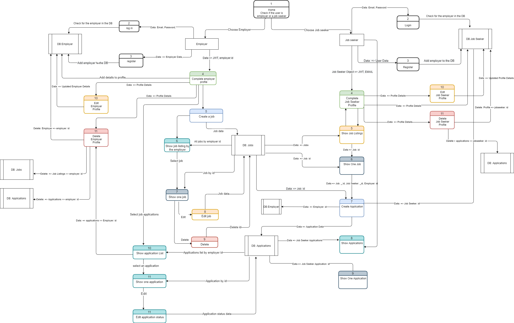

## Application Architecture Diagram

[Link to Diagrams.net Architecture diagram](https://drive.google.com/file/d/1OrWT3w7WxmWrqiDimOpc0sUHPYZAIpKD/view?usp=sharing)

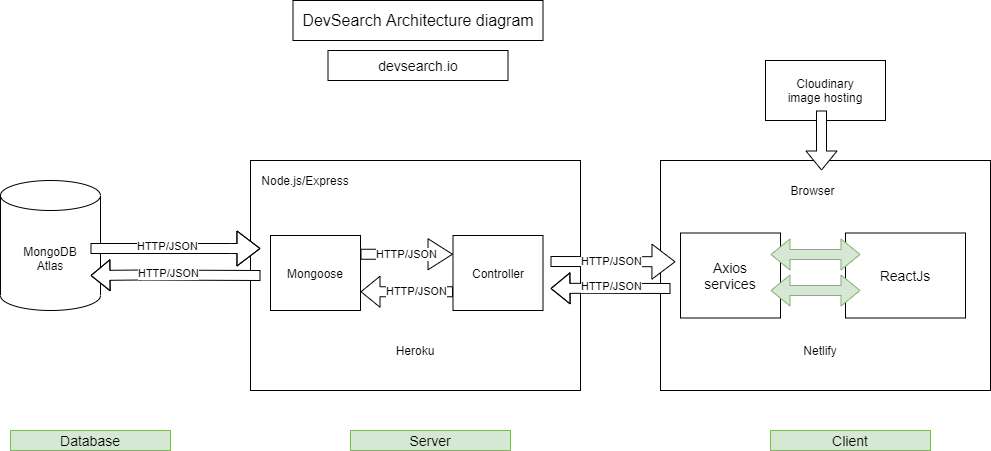

## User Stories

### First iteration :

In our first iteration of creating the user stories, we created them based heavily on technical requirements

As an employer I want to be able to:

- Create an employer account and store my information in my employer profile so I can become an employer in DevSearch.
- Log in using my unique profile so I can use the application.
- Create a job so job seekers can see it.
- Update the status of the job applications to either be accepted for an interview, hired, rejected.

### Second Iteration :

We decided to create user stories based on the user needs and perspective, we started creating a list of the employer wants and began a job seeker list to add multiple stories per feature.

As an employer I want to:

1.  Advertise available job positions in my company, so I can find the right person for the job.
2.  Have a company profile so the job seekers can see the company details on the job advertisement page.
3.  Manage and track the hiring process entirely using the application so I do not lose track of the application.
4.  Check the applicant details for each application so I can reject them or proceed with the hiring process.
5.  Download applicants ' resumes so I can have a printable version of them.
6.  Set an interview time from the calendar so the job seeker can accept it or reject it.
7.  Reject applicants after receiving their job applications or after interviewing them so I can keep track of the hiring process.
8.  Make an offer to an applicant so the applicant accepts it or rejects it.
9.  Use the application from my phone, so I can access it when outside of the office.
10. Visually differentiate the job applications based on where they are at the hiring process, so I can better picture my job applications and easily proceed with the hiring process. As an employer I want to:

11. I run a small development agency and I am currently looking to hire a Junior Developer, I don't have time to not only sort through dozens of applications, while also writing emails and making calls to organize an interview, So I want an application that can do it all, track my job listings, allow me to easily schedule an interview and send important information such as contracts. This will allow me to better focus my time on making sure the candidates I choose are best suited for the role and keep on track with my large workload.

As a Job Seeker I want to:

1.  View a list of available jobs with a brief overview of the job, so that I can pick a job that suits my skillset
2.  Upload a Resume and select it when applying for a new job, so that I can maximize my time while looking for work.
3.  Add a new cover letter to each application, so that I can personalize my application for a specific position
4.  Keep track of the progress of my application, so that I know if a job has potential or I should move on to another job.
5.  Recieve feedback from a company regarding my application, so that I can better understand my application's weak spots and improve.
6.  Maintain a list of applications that have been sent even if they were rejected, so that I can better track my time and provides evidence of my job search history.
7.  Be able to accept or decline an interview or contract, so that I proceed with Jobs that best suit me and my circumstances.

8.  As a recent graduate from a web development Bootcamp, who is looking for my first role as a Front End developer. I want a simple and convenient way to track what jobs I have applied for while receiving feedback from potential employers. This feedback will be crucial as I adapt and change both my resume and portfolio to better suit the positions I am looking for. The ability to track what positions I have applied for will allow me to focus on more important things such as improving my development skills, instead of worrying if I have been shortlisted or rejected for a position.

## Wireframes

##### Link to the Wireframes in Figma

[Link to Figma Board.](https://www.figma.com/file/E9KSA9VcggekHrZqaQTocy/DevSearch?node-id=0%3A1)

##### All Wireframes

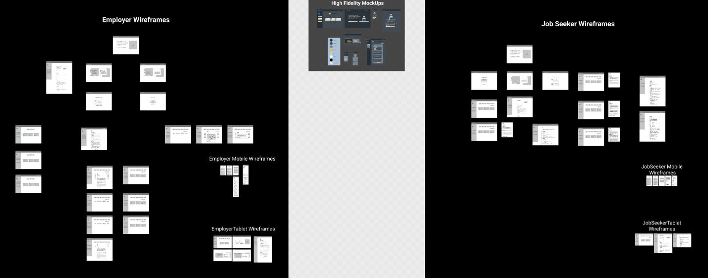

##### All High Fidelity Wireframes


### High Fidelity Wireframes

##### High Fidelity Desktop Landing Page

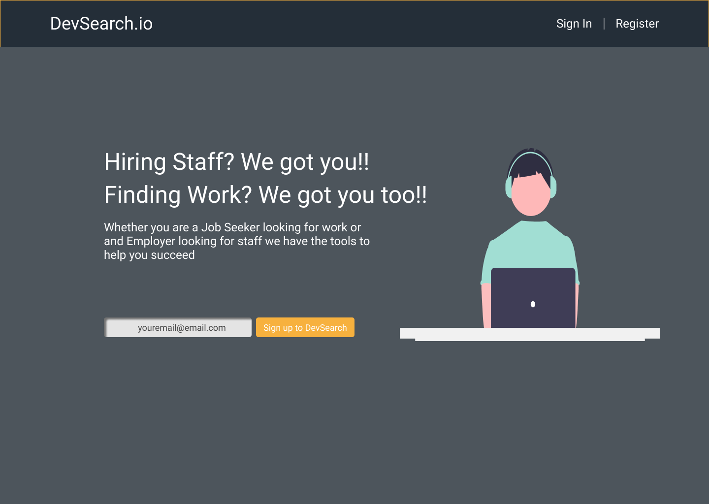

##### High Fidelity Tablet Landing Page

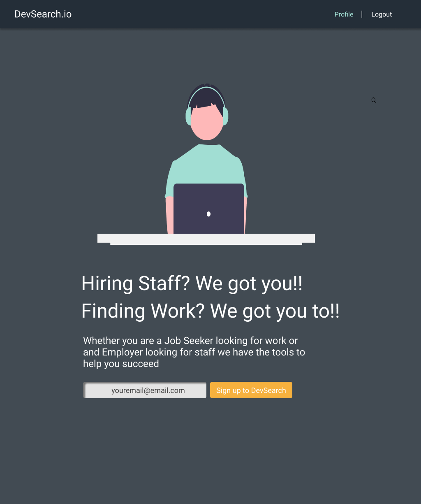

##### High Fidelity Mobile Landing Page

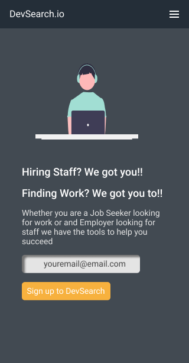

---

##### High Fidelity Employer Add Job Page

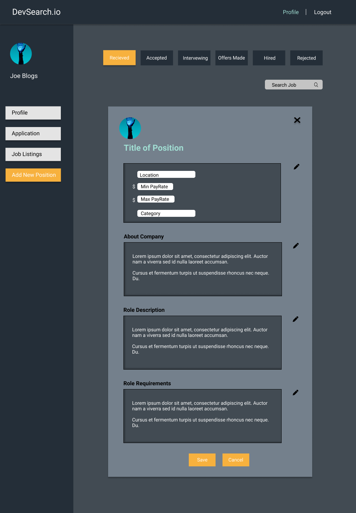

##### High Fidelity Login Page Tablet

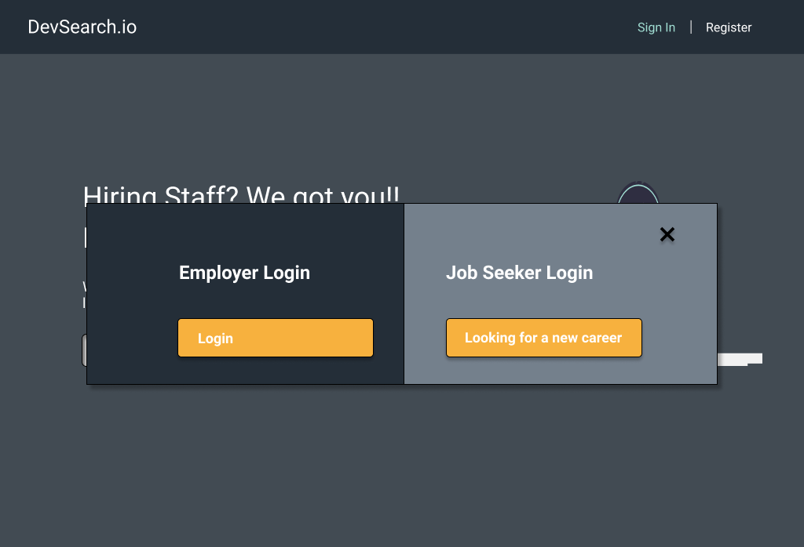

##### High Fidelity Employer Job Listings Card

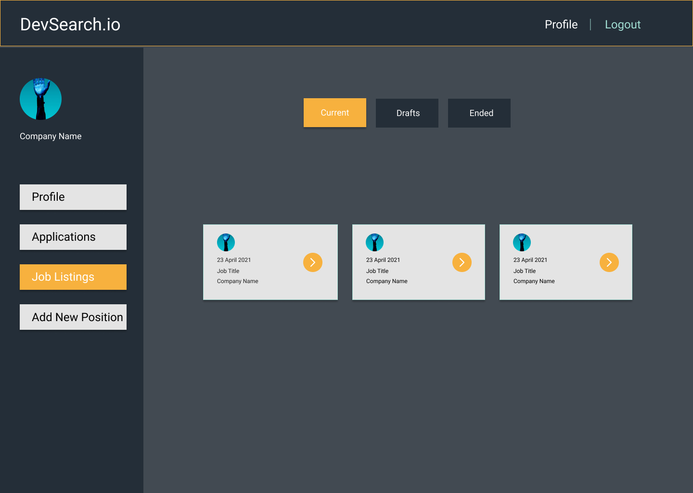

##### High Fidelity Mobile Job Seeker Job Lisitings

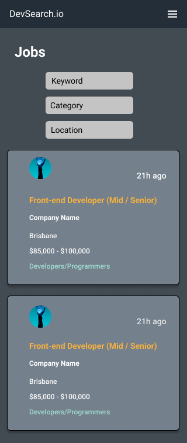

##### High Fidelity Mobile Apply for Job Page

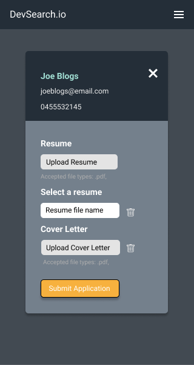

---

### Desktop Low Fidelity

#### Employer

##### All Low Fidelity Desktop Employer Wireframes

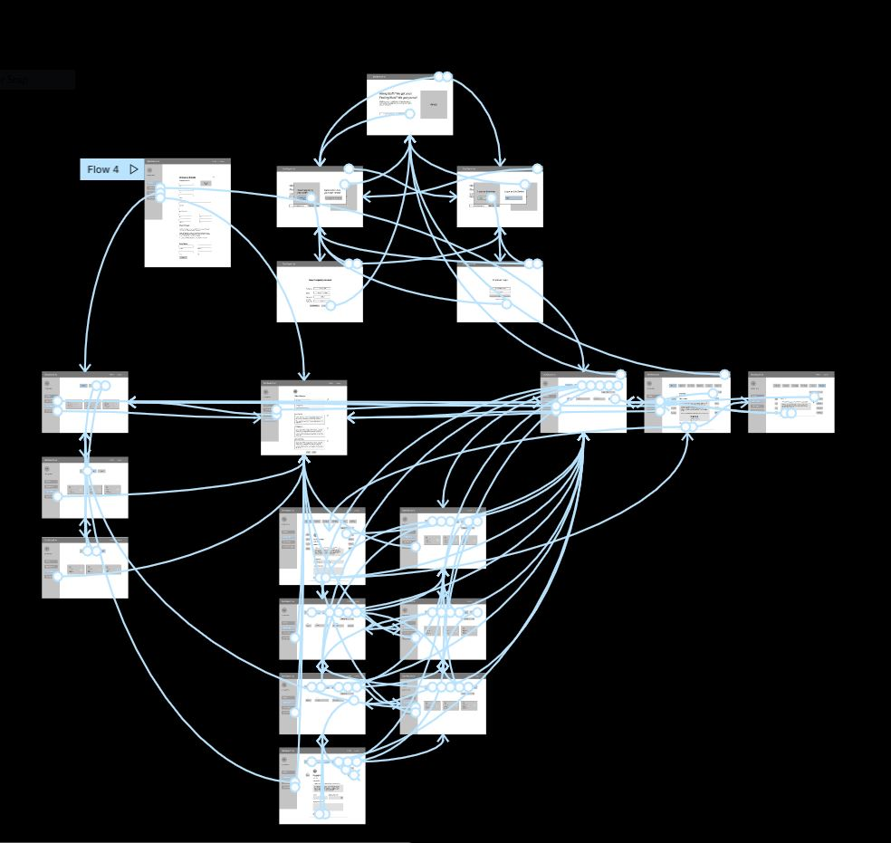

##### Low Fidelity Desktop Employer Application Feedback

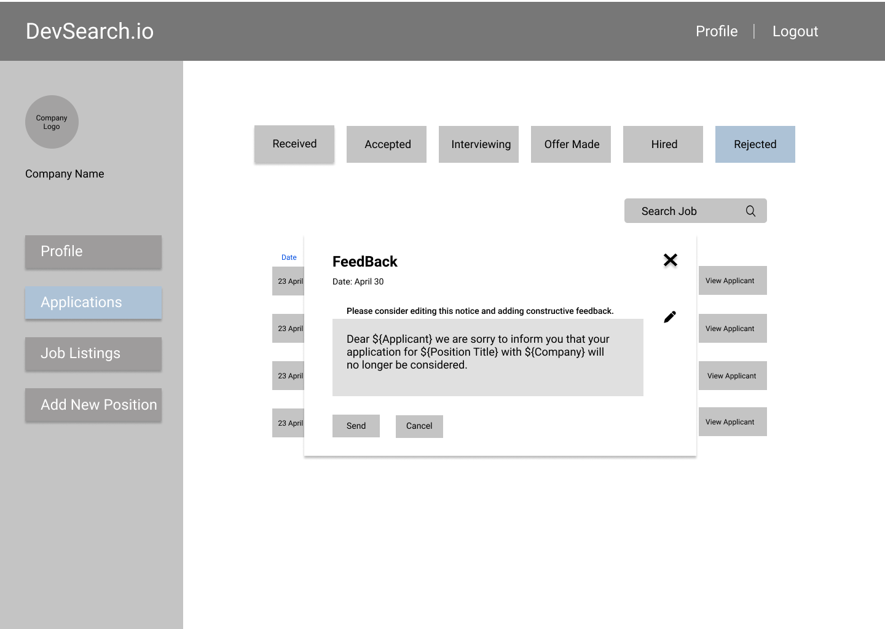

##### Low Fidelity Desktop Employer Offer Interview Modal

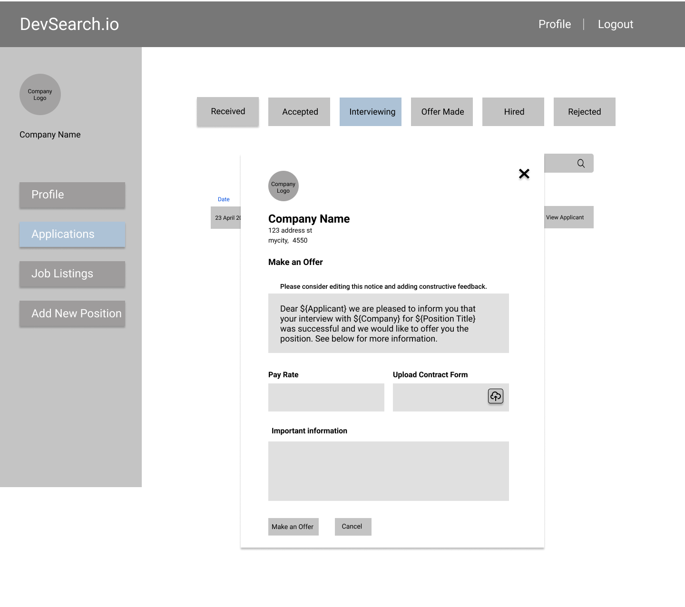

##### Low Fidelity Desktop Employer Offer Interview Modal


##### Low Fidelity Desktop Employer Applications Recieved Empty Page


##### Low Fidelity Desktop Employer Response for Interview Offer Modal

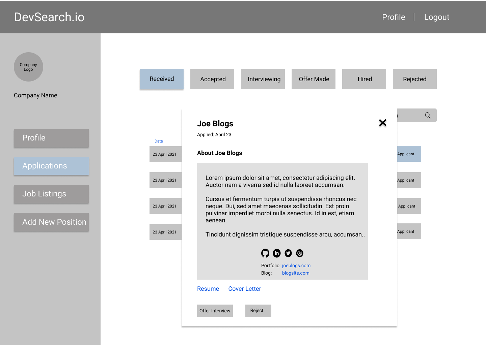

##### Low Fidelity Desktop Employer Job Lisitings


##### Low Fidelity Desktop Employer Job Lisitings View Position


##### Low Fidelity Desktop Employer Profile


##### Low Fidelity Desktop Employer Login Modal


##### Low Fidelity Desktop Employer Sign Up Modal


##### Low Fidelity Desktop Employer Login Page


##### Low Fidelity Desktop Employer Registration Page


---

#### JobSeeker

#### Low Fidelity Desktop JobSeeker Applications Page


#### Low Fidelity Desktop JobSeeker Job Lisitings Page


#### Low Fidelity Desktop JobSeeker Profile Page


#### Low Fidelity Desktop JobSeeker Registration Page


#### Low Fidelity Desktop JobSeeker Company Offerd Position Modal


#### Low Fidelity Desktop JobSeeker Company Offerd Interview Modal


#### Low Fidelity Desktop JobSeeker FeedBack Modal


#### Low Fidelity Desktop JobSeeker Login


##### All Low Fidelity Desktop Job Seeker Wireframes


---

### Tablet Low Fidelity

<!-- This only has two frames listed as it is basicaly the same as desktop -->

#### Employer

##### All Employer Tablet Wireframes

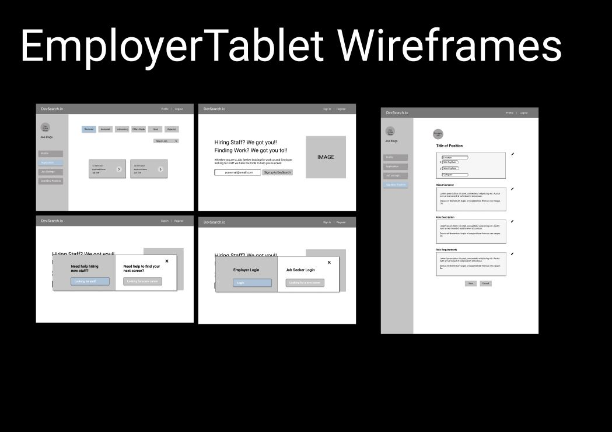

#### Job Seeker

##### All JobSeeker Tablet Wireframes

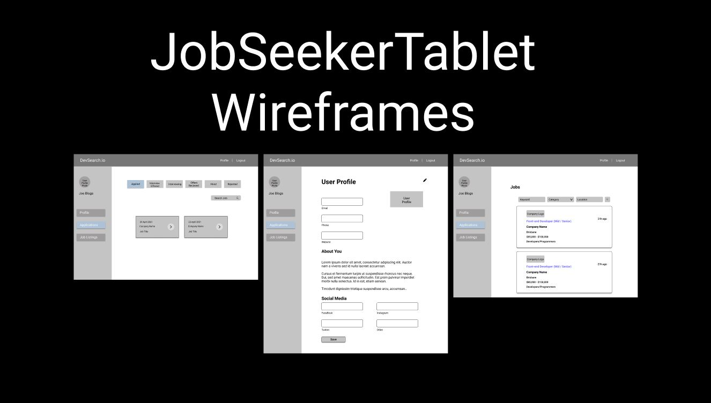

---

### Mobile Low Fidelity

#### Employer

#### All Employer Mobile Wireframes

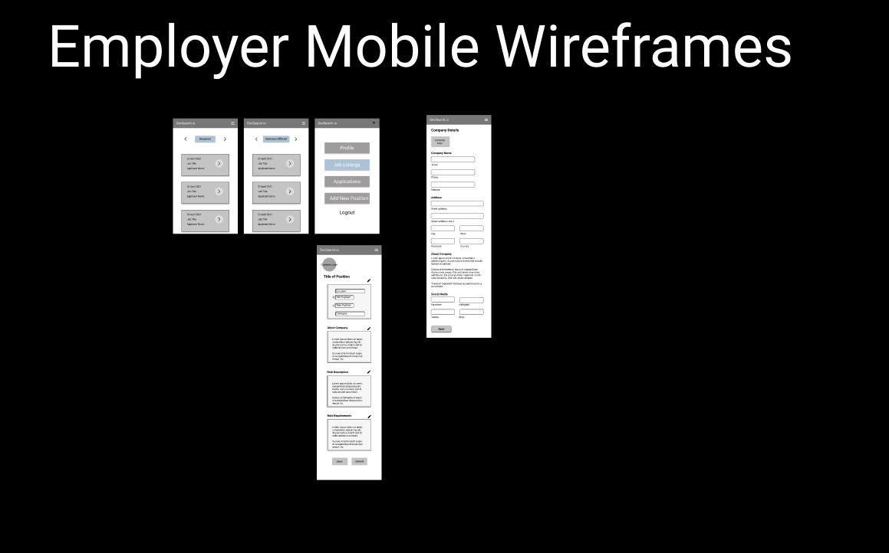

##### Employer Mobile Accepted Applications


##### Employer Mobile Add New Job


##### Employer Mobile Menu


##### Employer Mobile Profile


#### Job Seeker

##### All Job Seeker Mobile Wireframes

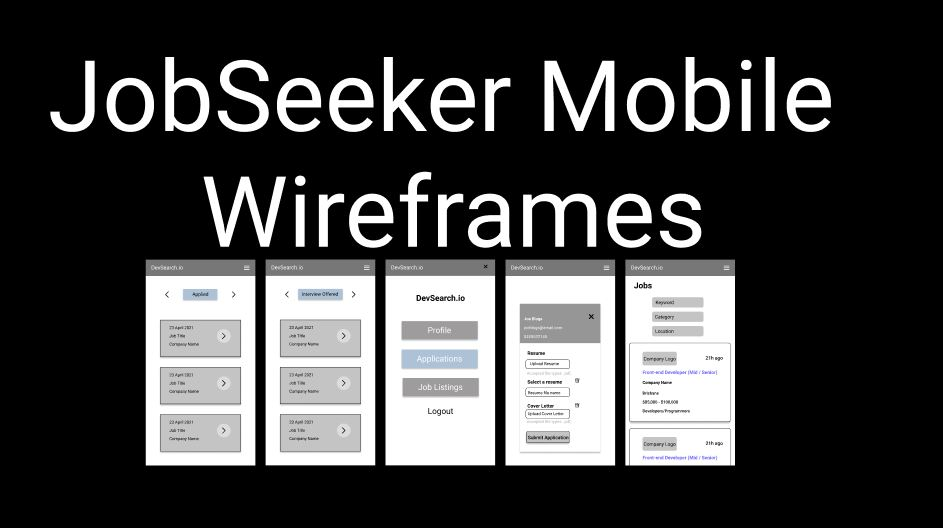

##### Job Seeker Mobile Apply For a Job


##### Job Seeker Mobile Menu


##### Job Seeker Mobile Applications Applied


##### Job Seeker Mobile Job Listings Page


---

## Agile Information

### GitHub and Trello Workflow
We have defined a process to allow us to integrate and track changes while developing our application. This includes using Card numbers on our Trello boards e.g(`AR-8`) and those card numbers are what we have used as the branch name for GitHub (`git branch AR-8`), each commit is also labed with the card number and if another trello card is required as a part of that branch then it is also labeled in the commit message.

## Example Commit Message:

`This is a representation of a single commit, this is not from a current commit message:`

```
<!-- git commit -->
---
AR-12: Created styled components for the tabs in the applications page,
AR-14: adjusted tab state to filter based on selected tabs
---
<!-- end commit -->
```

Our workflow also included both parties pulling, pushing and merging data, at all times we were in constant communication regarding any version control request to any Priority branch such as Development or Main. We also worked together to solve Merge conflicts and we typically solved conflicts localy before pushing to the priority branch.


## Who does what Trello Task

We initially split the application into front-end and backend tasks with Anthony's primary focus being the front end and Roba's on the Back End, however, both parties implemented and worked on components front and back. We also communicated daily through discord in both text and voice/video chat about what we were working on and any queries related to that task. At no stage during this project did we not communicate our intentions with a feature or a change without at least informing the other person first. This helped up to also keep merge conflicts to a minimum. 

[Link to Trello Board.](https://trello.com/b/asm78QlN)

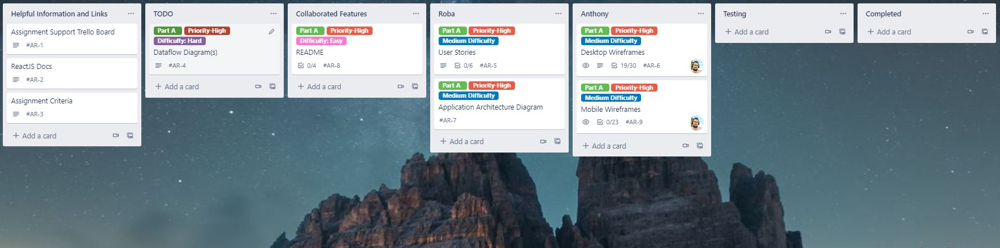


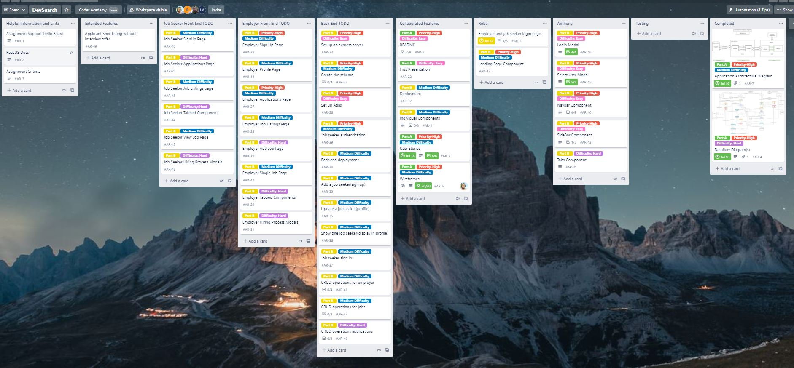
